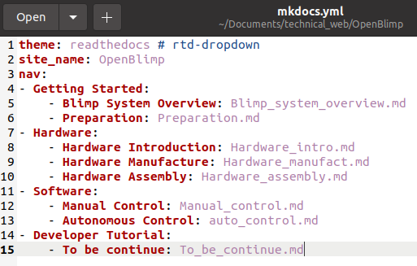

# Contributor Tutorial

To contribute to this repo, there are several things you need to know first.

## Requirements

MkDocs is a static site generator for creating project documentation. The document source code is written in Markdown. After configuration, it can automatically generate a site with a directory structure, which is often used to write technical documents and personal blogs. 

Installing MkDocs requires Python and Python package manager pip, if you already have `Python` and `pip`, open the terminal and `execute` the following command:

```
pip install mkdocs
```

## How to git

There will be three different branches: 

- main

  `main` branch is only for version release, do not work on this branch, contact Zhaoliang(zhz03@g.ucla.edu) if you need to do anything with it.

- develop

  `develop` branch is for development, do not directly work on it. If you need to merge your `feature` branch to `develop`, require a pull request before mering.

- feature/xxx

  `feature/xxx` branch is for contributors to commit, make a new `feature/xxx` branch before you want to edit anything, where `xxx` is the name of your own part. 

## Activate server locally

MkDocs includs a built-in server to preview the current document locally.  Under the project directory, execute `mkdocs serve` to activate the built-in server:

```
mkdocs serve
```


After execution, open the link http://127.0.0.1:8000/ in the browser to see your update, like this:


## Add new pages

To add new pages, all you need to do is to create a Markdown file and put it under the `docs` directory. Here as an example, we put `TO_be_continue.md` in to `docs` directory.


Open `mkdocs.yml` configuration file, and make changes as follows: 



After save this file, you should be able to see the effect immediately on your browser. To add more content, all you need to do is to edit corresponding markdown files. How simple is that! 

## Build locally

To build your site, under your project directory. Open terminal and execute `mkdocs build` command as below:

```
mkdocs build
```


After this step, you should be able to see a `site` directory under your project directory, and it contains all your `html` files. 