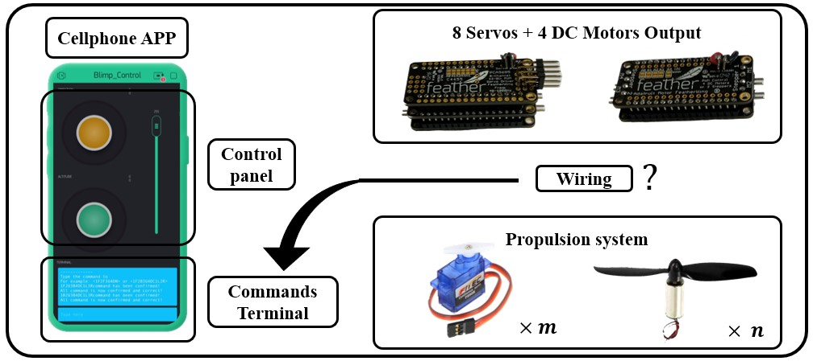

# Hardware Mapping

## Introduction

For the blimp system, one important aspect to notice is the mapping between your control and hardware. We design a user interface for normal user to easily control blimps they design. However, to control blimp exactly as expected, users need to build up the correct mapping between control and propulsion system of blimps. To be more specific, what's the right wiring and control mapping as shown below:

For example, you want to build a blimp that has 4 motors+propellers output, two specific motors can control the horizontal motion of your blimp and the other two motors need to handle the vertical motion while the horizontal motors should also make your blimp rotate. How do you match your motors with your joystick controller if you need only one joystick to control both horizontal motion and the other joystick to control vertical motion.

As we introduced before, we choose Blynk APP as the control interface since it’s a freely available application that anyone could download online. As shown in the figure above, the control panel contains two joysticks to control blimp movement(horizontal and vertical) and one slider to control all motors speed.

## Installation

- **Step 1: Install Blynk App**

  Follow the instruction in the previous section [User interface]() to setup your Blynk App.

- **Step 2: Upload Arduino program**

  Since the wiring of electronics will directly determine how to manipulate the custom blimp, we provide users ready-to-go low-level Arduino program to handle the wiring and connection between the control board and motor propellers and allows users to re-map the control to the actual propulsion system they design through the terminal panel.

- **Step 3: Input the correct configuration commands through 3-step experiments** 

  To find out the correct command that matches the mapping, users need to go over the following three iterations:

    (Iter. 1) Initialization: Initial command "1F2B3U4DN" means that DC motor channel 1 is "forward" rotation, channel 2 is "backward" rotation, channel 3 is "upward" rotation, channel 4 is "downward" rotation, and the left and right direction is not confirmed. 

    (Iter. 2) Determine main horizontal and vertical channel: based on the actual propellers rotation and activation situation, use joystick to check if previous command is correct, if not, then change the command to determine the correct horizontal and vertical channel and rotation direction. Command after iteration example: "1F2F3U4DC1L2R". The last 5 digits means that horizontal and vertical channel are confirmed using DC motor and assume channel 1 to rotate left and channel 2 to rotate right. 

    (Iter. 3) Determine the rotation channel from previous command: if the previous command is correct then stop. If not, then switch the rotation channel, for example: "1F2F3U4DC2L1R". 

Here are two case study of using "error and trial" method to figure out the correct configuration commands:

